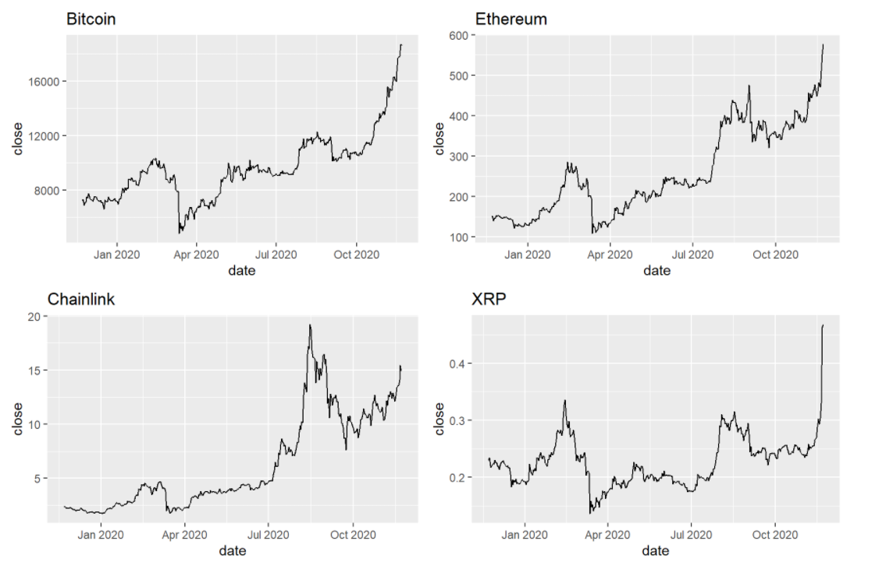

Cryptocurrency Analysis
================
Damien Fleminks
21/11/2020

### install and setup packages

``` r
#  rvest for web scraping
#  -> install.packages('rvest')
library(rvest)

#  tidyverse & gridExtra for data manipulation & visualization
#  -> install.packages("tidyverse")
#  -> install.packages("gridExtra")
library(tidyverse)
library(gridExtra)

# httr & jsonlite for rest api
#  -> install.packages("httr")
#  -> install.packages("jsonlite")
require("httr")
require("jsonlite")

#  rlist to extend list functions
#  -> install.packages("rlist")
library(rlist)
```

### Web scraping and data cleanup

Use coinranking.com to get top 50 cryptocurrency coins and retrieve the
ticker symbol, coin name & current market cap

``` r
crypto.url <- read_html("https://coinranking.com/")

crypto.tickers <- crypto.url %>% 
  html_nodes(".profile__subtitle") %>% 
  html_text()

crypto.name <- crypto.url %>% 
  html_nodes(".profile__link") %>% 
  html_text()

crypto.market.cap<- crypto.url %>% 
  html_nodes(".valuta") %>% 
  html_text()
```

Clean up the strings by removing unused characters and split into
separate vectors

``` r
crypto.tickers <- str_trim(str_remove_all(crypto.tickers, "\n"))
crypto.name <- str_trim(str_remove_all(crypto.name, "\n"))
crypto.unit.price <- crypto.market.cap[c(TRUE,FALSE)]
crypto.market.cap <- crypto.market.cap[c(FALSE,TRUE)]
```

Convert to correct data types and track which market cap price uses
price unit in billion so we can multiply all output into units of
million

``` r
crypto.isbil <-  str_detect(crypto.market.cap,"billion")
crypto.unit.price <-  as.numeric(gsub("[^0-9.]", "", crypto.unit.price))

# find billion values and change them into million units
crypto.market.cap <- as.numeric(gsub("[^0-9.]", "", crypto.market.cap))
for(i in 1:length(crypto.isbil)){
     if(crypto.isbil[i]){
         crypto.market.cap[i] <- crypto.market.cap[i] * 1000
     }
}

# Create data frame of scraped and formatted data
crypto.currencies <- data.frame(Cryptocurrency = crypto.name, Ticker = crypto.tickers, Price=crypto.unit.price, market.cap = crypto.market.cap)
```

We now have a cleaned up Data frame with currency data that was taken
from coinranking.com. We will use this data to retrieve historical price
data from an api.

``` r
print(
  head(crypto.currencies)
)
```

    ##   Cryptocurrency Ticker      Price market.cap
    ## 1        Bitcoin    BTC 18252.0400     338870
    ## 2       Ethereum    ETH   562.2700      63630
    ## 3            XRP    XRP     0.5489      24200
    ## 4     Tether USD   USDT     1.0000      19730
    ## 5       Litecoin    LTC    76.3000       5060
    ## 6       Polkadot    DOT     4.8900       4990

### Get historical price data from REST API

With the data collected from the web we will retrieve historical pricing
data from api.tiingo.com API, we will start by by setting up the URL to
execute a GET request. An account with API token is needed from
api.tiingo.com, I requested a free token which had a limit of 20K
requests a day which should be more then enough.

``` r
#  Setting up base URL for cryptocurrency price history API
api.base <- "https://api.tiingo.com/tiingo/crypto/prices"

# Set currency used for pricing cryptocurrencies
api.currency <- "usd"

#  Retrieve history for top 5 cryptocurrencies, using the tickers from our cryptocurrency data frame
api.tickers <- paste(crypto.currencies$Ticker[1:5],"usd",sep="")
api.tickers <- paste(api.tickers, collapse = ',')
# Start date to retrieve prices in YYYY-MM-DD format, set 1 year from today
api.startdate <- as.POSIXlt(Sys.Date())
api.startdate$year <- api.startdate$year-1
api.startdate <- as.Date(api.startdate)

# set the frequency in which you want data resampled 
api.resampleFreq = "1day"

# API token for authentication  (A free token can be requested at: api.tiingo.com, but you can use mine for now)
api.token = "20b7879009ee4863aef6a4dfd06fb50fb9ea447e"

# Combine variables into GET URL 
api.call <- paste(api.base, "?tickers=",api.tickers,"&startDate=",api.startdate,"&resampleFreq=",api.resampleFreq,"&token=",api.token,sep='')
```

Make GET request with the request URL and store response in variable, we
will convert the result into JSON and clean up the data and format it
into a usuable format for our analysis.

``` r
api.prices <- GET(api.call)

#  Format response to JSON
api.prices_text <- content(api.prices, "text")
api.prices_json <- fromJSON(api.prices_text, flatten = TRUE)
api.prices_df <- as.data.frame(api.prices_json)

#  Create a single data frame with formatted data for easier data visualization and  correct data types

returnNewDf <- function(index){
  
  #  Get coin and store dataframe
  temp.coin <- api.prices_df$baseCurrency[index]
  temp.df <- api.prices_df[index,][[4]][[1]]
  
  # Get length and store coin name as new column
  temp.rownumber <- length(temp.df[,1])
  temp.df$coin <- rep(c(temp.coin),each=length(temp.rownumber))
  temp.df$date <- as.Date(temp.df$date)
  
  #  To calculate the price value of max in terms of percentage add new column with percentages of close 
  temp.df$price.percentage <- temp.df$close/max(temp.df$close)
  
  return(temp.df)
}

#  Add first data frame, then loop to add the rest
crypto.all <- returnNewDf(1)
for(i in 1:length(api.prices_df[,1])) {
  crypto.all <- rbind(
    crypto.all,returnNewDf(i)
    
  )
}
```

Now we can access all coins from the same data frame with the different
unique coins, looking at the head of 2 examples

``` r
unique(crypto.all[c('coin')])
```

    ##      coin
    ## 1     btc
    ## 735   eth
    ## 1102  ltc
    ## 1469  xrp

``` r
print(
  head(filter(crypto.all, coin=='btc'))
)
```

    ##       high       date      low tradesDone    close     open   volume
    ## 1 7661.697 2019-12-09 7274.841     438772 7342.620 7517.407 65033.53
    ## 2 7409.128 2019-12-10 7159.498     514511 7225.307 7340.929 61604.03
    ## 3 7276.874 2019-12-11 7128.879     336152 7210.088 7225.744 40023.15
    ## 4 7302.802 2019-12-12 7084.571     407312 7198.602 7210.588 57418.48
    ## 5 7308.903 2019-12-13 7191.353     323726 7258.717 7197.521 38007.89
    ## 6 7272.773 2019-12-14 7012.930     347467 7067.233 7258.641 38128.94
    ##   volumeNotional coin price.percentage
    ## 1      477516508  btc        0.3727445
    ## 2      445108043  btc        0.3667892
    ## 3      288570449  btc        0.3660166
    ## 4      413332834  btc        0.3654335
    ## 5      275888502  btc        0.3684852
    ## 6      269466107  btc        0.3587647

``` r
print(
  head(filter(crypto.all, coin=='eth'))
)
```

    ##       high       date      low tradesDone    close     open   volume
    ## 1 151.2740 2019-12-09 146.6895     109866 147.4179 150.5599 460701.9
    ## 2 148.3835 2019-12-10 143.8853     110471 145.6068 147.4286 534537.8
    ## 3 146.3632 2019-12-11 142.1659      93453 143.4108 145.5938 401814.1
    ## 4 145.9552 2019-12-12 139.2701     127244 144.8781 143.4336 615179.0
    ## 5 145.5472 2019-12-13 142.8940     102316 144.7974 144.8458 429064.6
    ## 6 145.0951 2019-12-14 141.1907      89769 141.8480 144.8032 337352.5
    ##   volumeNotional coin price.percentage
    ## 1       67915715  eth        0.2390601
    ## 2       77832336  eth        0.2361231
    ## 3       57624482  eth        0.2325620
    ## 4       89125973  eth        0.2349414
    ## 5       62127431  eth        0.2348105
    ## 6       47852788  eth        0.2300277

### Visualizing the data

We can analyze the price of the coins over time to see how they have
performed over the past year.

``` r
# Plot a line graph for all coin prices
cPrice1 <- ggplot(filter(crypto.all, coin=='btc'), aes(x=date,y=close)) + geom_line() + ggtitle("Bitcoin")
cPrice2 <- ggplot(filter(crypto.all, coin=='eth'), aes(x=date,y=close)) + geom_line() + ggtitle("Ethereum")
cPrice3 <- ggplot(filter(crypto.all, coin=='link'), aes(x=date,y=close)) + geom_line() + ggtitle("Chainlink")
cPrice4 <- ggplot(filter(crypto.all, coin=='xrp'), aes(x=date,y=close)) + geom_line() + ggtitle("XRP")
grid.arrange(cPrice1 , cPrice2, cPrice3, cPrice4, nrow = 2)
```

<!-- -->

As we have added an extra column to compare the percentage of the price
to the max price we can compare how all coins compared relatively from
each other in terms of price fluctation.

``` r
# Compare the different coins on the percentage growth
ggplot(crypto.all, aes(x=date,y=price.percentage)) + geom_line(aes(color=coin)) + ggtitle("Price Fluctation")      
```

<!-- -->

From the tradesDone and volumeNotional column we can analyze the number
of transitions and total volume in USD traded, we will compare the
results and look at the daily trend over the year and the total numbers.

``` r
# Compare  frequency & volume in USD of trades over the last year

cTradeComp <- ggplot(crypto.all, aes(x=date,y=tradesDone)) + geom_line(aes(color=coin))  + ggtitle("Transactions per day")  
cVolComp <- ggplot(crypto.all, aes(x=date,y=volumeNotional)) + geom_line(aes(color=coin))  + ggtitle("Volume in USD per day")  
grid.arrange(cTradeComp , cVolComp, nrow = 2)
```

<!-- -->

``` r
# Compare total frequency & volume of trade 

cTradeTotal <-ggplot(crypto.all) + geom_bar(aes(y=tradesDone, x=coin, fill=factor(coin)), stat="identity")  + ggtitle("Total transactions")  
cVolTotal <- ggplot(crypto.all) + geom_bar(aes(y=volumeNotional, x=coin, fill=factor(coin)), stat="identity") + ggtitle("Total volume traded in USD")  
grid.arrange(cTradeTotal , cVolTotal, nrow = 1)
```

<!-- -->
